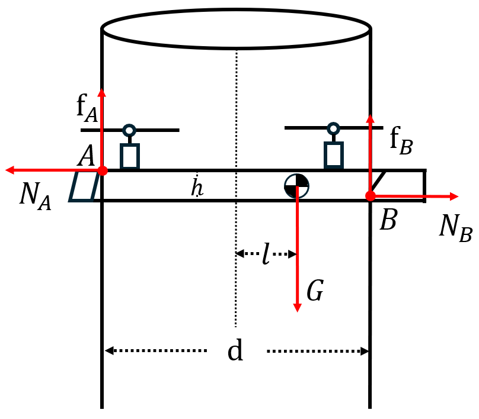
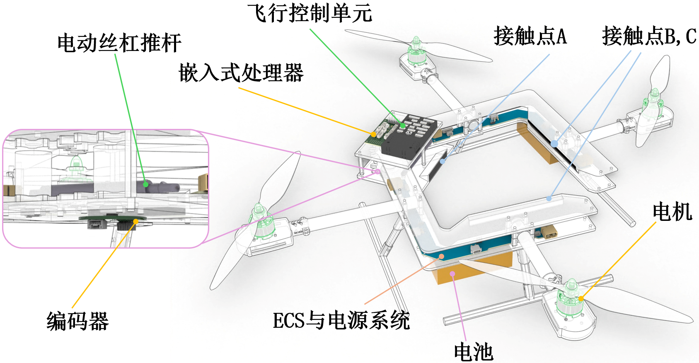
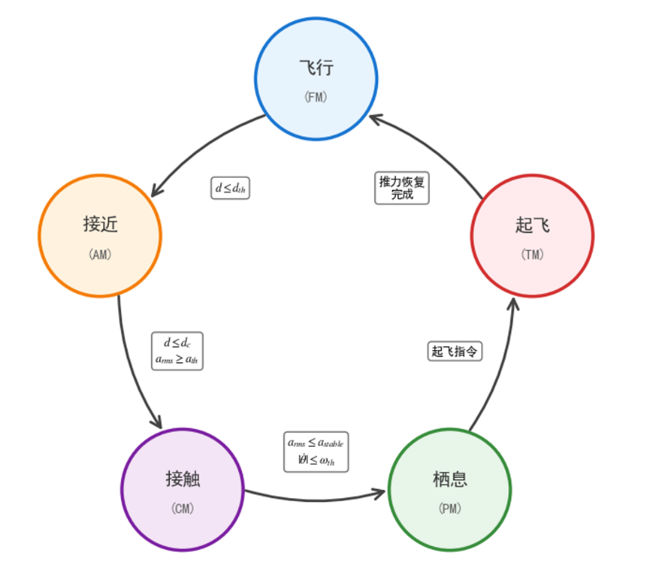
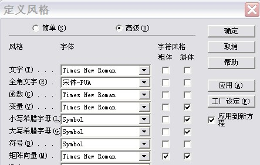

DOI：10.13973/j.cnki.robot.240001

# 一种面向柱状结构栖息作业的变形飞行机器人

## 王海昕，张 陈，匡红艳

（《机器人》编辑部，辽宁 沈阳 110016）

## 摘 要：针对电力杆塔等柱状基础设施检测过程中传感器部署困难及人工高空作业风险高的问题，提出了一种利用机身变形实现在柱状结构上栖息作业的飞行机器人。机器人通过电机驱动左右机身开合，在接近柱体后能够实现在柱体上低能耗的稳定栖息，并通过接触点上的传感器完成定点检测。首先，基于有限状态机的分阶段控制策略，实现包括飞行接近、姿态对准、机身变形附着以及稳定栖息的整个栖息过程；其次，进行了柱面附着稳定性与检测能力测试。实验结果显示，该机器人能够稳定完成对直径为160-250mm多种材质柱体的长期栖息作业。在使用加速度计进行振动检测上，机器人。研究结果表明，该机器人能够有效实现柱状结构的稳定栖息与定点检测。

## 关键词：变形飞行机器人；定点作业；有限状态机；振动检测

### Template of Journal *ROBOT* and a Simple Guide for Authors 

WANG Haixin, ZHANG Chen, KUANG Hongyan

（*Editorial Office of ROBOT*, *Shenyang* 110016, *China*）

> **Abstract:** 英文翻译要求，以句子为单位实词严格对应，不可"意译"；我刊统一采用一般现在时、被动式，不用we或this paper作主语。□□□□□□□□□□□□□□□□□□□□□□□□□□□□□□□□□□□□□□□□□□□□□□□□□□□□□□□□□□□□□□□□□□□□□□□□□□□□□□□□□□□□□□□□□□□□□□□□□□□□□□□□□□□□□□□□□□□□□□□□□□□□□□□□□□□□□□□□□□□□□□□□□□□□□□□□□□□□□□□□□□□□□□□□□□□□□□□□□□□□□□□□□□□□□□□□□□□□□□□□□□□□□□□□□□□□□□□□□□□□□□□□□□□□□□□□□□□□□□□□□□□□□□□□□□□□□□□□□□□□□□□□□□□□□□□□□□□□□□□□□□□□□□□□□□□□□□□□□□□□□□□□□□□□□□□□□□□□□□□□□□□□□□□□□□□□□□□□□□□□□□□□□□□□□□□□□□□□□□□□□□□□□□□□□□□□□□□□□□□□□□□□□□□□□□□□□□□□□□□□□□□□□□□□□□□□□□□□□□□□□□□□□□□□□□□□□□

## **Keywords**: writing guidelines for academic papers; format requirements; quantities and units; rules for

## bibliographic references

引言内容通常包含研究的背景、目的、理由，预期结果及其意义和价值。引言的编写宜做到：切合主题，言简意赅，突出重点、创新点；不宜单纯罗列前人研究成果，也不宜复制摘要内容或作章节简介。引言内容通常包含研究的背景、目的、理由，预期结果及其意义和价值。引言的编写宜做到：切合主题，言简意赅，突出重点、创新点；不宜单纯罗列前人研究成果，也不宜复制摘要内容或作章节简介。

引言内容通常包含研究的背景、目的、理由，预期结果及其意义和价值。引言的编写宜做到：切合主题，言简意赅，突出重点、创新点；不宜单纯罗列前人研究成果，也不宜复制摘要内容或作章节简介。

引言内容通常包含研究的背景、目的、理由，预期结果及其意义和价值。引言的编写宜做到：切合主题，言简意赅，突出重点、创新点；不宜单纯罗列前人研究成果，也不宜复制摘要内容或作章节简介。

引言内容通常包含研究的背景、目的、理由，预期结果及其意义和价值。引言的编写宜做到：切合主题，言简意赅，突出重点、创新点；不宜单纯罗列前人研究成果，也不宜复制摘要内容或作章节简介。

引言内容通常包含研究的背景、目的、理由，预期结果及其意义和价值。引言的编写宜做到：切合主题，言简意赅，突出重点、创新点；不宜单纯罗列前人研究成果，也不宜复制摘要内容或作章节简介。

引言内容通常包含研究的背景、目的、理由，预期结果及其意义和价值。引言的编写宜做到：切合主题，言简意赅，突出重点、创新点；不宜单纯罗列前人研究成果，也不宜复制摘要内容或作章节简介。

引言内容通常包含研究的背景、目的、理由，预期结果及其意义和价值。引言的编写宜做到：切合主题，言简意赅，突出重点、创新点；不宜单纯罗列前人研究成果，也不宜复制摘要内容或作章节简介。

引言内容通常包含研究的背景、目的、理由，预期结果及其意义和价值。引言的编写宜做到：切合主题，言简意赅，突出重点、创新点；不宜单纯罗列前人研究成果，也不宜复制摘要内容或作章节简介。

引言内容通常包含研究的背景、目的、理由，预期结果及其意义和价值。引言的编写宜做到：切合主题，言简意赅，突出重点、创新点；不宜单纯罗列前人研究成果，也不宜复制摘要内容或作章节简介。

引言内容通常包含研究的背景、目的、理由，预期结果及其意义和价值。引言的编写宜做到：切合主题，言简意赅，突出重点、创新点；不宜单纯罗列前人研究成果，也不宜复制摘要内容或作章节简介。

（此处为introduction）

1 柱栖机器人系统设计与机理分析（Pole-Perching Robot System Design and mechanism analysis）

1.1 飞行-栖息双模式力学建模

本文所提出的柱栖机器人以四旋翼飞行平台为基础构型，通过机身结构的主动开合实现对柱状结构的接触与附着。在栖息阶段，机器人两侧结构与柱面形成离散接触，可等效为多刚体接触系统，其稳定性由接触力平衡与摩擦约束共同决定。为分析其附着机理，建立如图1所示的简化力学模型。

图1 机器人柱面栖息受力示意图\
Fig.1 Diagram of force analysis on the robot during cylindrical surface perching

机器人前后结构分别在柱面形成接触点 $A$与 $B$，接触处存在法向支撑力 $N_{A},N_{B}$及切向摩擦力 $f_{A},f_{B}$，系统受重力 $G$。设两接触点间距为 $d$，接触点之间高度为 $h$，质心相对A,B两点几何中心偏移距离为 $l$。

在静态附着条件下，系统满足力与力矩平衡关系。水平方向受力平衡为

$$\begin{matrix}
N_{A} = N_{B} & & \mathrm{(1)} \\
\end{matrix}
$$

竖直方向满足

$$\begin{matrix}
f_{A} + f_{B} = G & & \mathrm{(2)} \\
\end{matrix}
$$

以接触点 $A$为转轴建立力矩平衡方程，可得

$$\begin{matrix}
N_{B}h + f_{B}d = G\left( \frac{d}{2}+l \right) & & \mathrm{(3)} \\
\end{matrix}
$$

根据库仑摩擦定律，接触点处切向力满足

$$\begin{matrix}
f_{i} \leq \mu N_{i}(i = A,B) & & \mathrm{(4)} \\
\end{matrix}
$$

在临界附着状态下，两接触点均达到最大静摩擦力，即

$$\begin{matrix}
f_{A} = f_{B} = \frac{G}{2} & & \mathrm{(5)} \\
\end{matrix}
$$

将式（5）代入式（3），并结合式（1），可得法向支撑力为

$$\begin{matrix}
N_{B} = \frac{Gl}{h} & & \mathrm{(6)} \\
\end{matrix}
$$

进一步结合摩擦约束（4），得到系统满足稳定附着的条件为

$$\begin{matrix}
\mu \geq \frac{h}{2l} & & \mathrm{(7)} \\
\end{matrix}
$$

由式（7）可知，柱面附着能力取决于摩擦因数与质心位置分布。相较于单纯提高接触摩擦特性，通过增大质心后移距离 $l$可有效降低附着所需摩擦条件，实现无额外能耗的稳定栖息。

在飞行阶段，四旋翼系统的控制性能同样受质心位置影响。设四个电机推力为 $f_{1},f_{2},f_{3},f_{4}$，系统总推力及绕机体系各轴的控制力矩为

$$\begin{matrix}
\begin{matrix}
F & = f_{1} + f_{2} + f_{3} + f_{4} \\
\tau_{x} & = (f_{2} - f_{4})\mathrm{ }l_{y} \\
\tau_{y} & = (f_{3} - f_{1})\mathrm{ }l_{x} \\
\tau_{z} & = c(f_{1} - f_{2} + f_{3} - f_{4}) \\
\end{matrix} & & \mathrm{(8)} \\
\end{matrix}
$$

其中，$l_{x},l_{y}$ 为电机相对于质心的等效力臂，$c$ 为反扭矩系数。

当质心位于机体几何中心时，电机分布满足对称性条件，悬停状态下推力近似均分

$$\begin{matrix}
f_{1} \approx f_{2} \approx f_{3} \approx f_{4} \approx \frac{G}{4} & & \mathrm{(9)} \\
\end{matrix}
$$

此时系统具有均衡的力矩输出能力与良好的控制线性特性。

当结构展开时，质心沿机体前进方向向后发生偏移，导致前后电机力臂不对称。为维持俯仰力矩平衡，需满足

$$\begin{matrix}
(f_{3} - f_{1})\mathrm{ }l_{x} = \tau_{y} & & \mathrm{(10)} \\
\end{matrix}
$$

力臂减小一侧需通过增大推力差进行补偿，从而引起推力分配不均。这将导致部分电机接近饱和，降低电机力效，并且限制系统机动能力与安全裕度。

此外，结构开合过程中电机相对质心的位置随时间变化，即 $l_{x},l_{y}$为时变量，使系统动力学呈现显著时变特性。因此，有必要建立结构参数与质心及电机位置之间的几何关系模型。

为此，将系统简化为如图二所示的，由左机身、中心结构及右机身构成的三刚体模型，其质量分别为 $m_{L},m_{C},m_{R}$，质心位置为 $\mathbf{r}_{L},\mathbf{r}_{C},\mathbf{r}_{R}$。系统整体质心为

$$\begin{matrix}
\mathbf{r}_{G} = \frac{m_{L}\mathbf{r}_{L} + m_{C}\mathbf{r}_{C} + m_{R}\mathbf{r}_{R}}{m_{L} + m_{C} + m_{R}} & & \mathrm{(11)} \\
\end{matrix}
$$

取中心结构为坐标原点，即 $\mathbf{r}_{C} = (0,0)$。左右机身分别绕 $\mathbf{p}_{L} = ( - x_{a},y_{a})$与 $\mathbf{p}_{R} = (x_{a},y_{a})$旋转，开合角度为 $\beta$。则其质心位置为

$${\begin{matrix}
 & \mathbf{r}_{L}(\beta) = \mathbf{p}_{L} + R(\beta)(\mathbf{r}_{L0} - \mathbf{p}_{L}) & & \mathrm{(12)} \\
\end{matrix}
}{\begin{matrix}
 & \mathbf{r}_{R}(\beta) = \mathbf{p}_{R} + R( - \beta)(\mathbf{r}_{R0} - \mathbf{p}_{R}) & & \mathrm{(13)} \\
\end{matrix}
}$$

其中旋转矩阵为

$$\begin{matrix}
R(\beta) = \begin{bmatrix}
\cos\beta & - \sin\beta \\
\sin\beta & \cos\beta \\
\end{bmatrix} & & \mathrm{(14)} \\
\end{matrix}
$$

代入式（11）可得质心随开合角度的变化关系

$$\begin{matrix}
\mathbf{r}_{G}(\beta) = \frac{m_{L}\mathbf{r}_{L}(\beta) + m_{R}\mathbf{r}_{R}(\beta)}{m_{L} + m_{C} + m_{R}} & & \mathrm{(15)} \\
\end{matrix}
$$

在结构对称条件 $m_{L} = m_{R}$下，有

$$\begin{matrix}
x_{G}(\beta) = 0\#(16) \\
\end{matrix}
$$

因此仅需关注纵向位置变化

$$\begin{matrix}
y_{G}(\beta) = \frac{m_{L}y_{L}(\beta) + m_{R}y_{R}(\beta)}{m_{L} + m_{C} + m_{R}}\#(17) \\
\end{matrix}
$$

电机固定于两侧机身，其位置同样满足旋转变换。记第 $i$个电机在纵向相对质心的位置为

$$\begin{matrix}
\Delta y_{i}(\beta) = y_{i}(\beta) - y_{G}(\beta) & & \mathrm{(18)} \\
\end{matrix}
$$

四旋翼俯仰控制能力与前后电机力臂直接相关。理想情况下应满足

$$\begin{matrix}
\mid \Delta y_{front}(\beta) \mid \approx \mid \Delta y_{rear}(\beta) \mid & & \mathrm{(19)} \\
\end{matrix}
$$

为量化力臂不均衡程度，引入归一化差异指标

$$\begin{matrix}
\varepsilon(\beta) = \frac{\mid d_{1}(\beta) - d_{2}(\beta) \mid}{\frac{d_{1}(\beta) + d_{2}(\beta)}{2}} & & \mathrm{(20)} \\
\end{matrix}
$$

其中 $d_{1},d_{2}$分别表示前后电机相对于质心的等效力臂。该指标反映推力分配对称性，当 $\varepsilon = 0$时系统完全对称。

基于此定义，构造全开合范围内的优化目标函数

$$\begin{matrix}
J = \int_{0}^{\beta_{\max}}\varepsilon^{2}(\beta)\mathrm{ }d\beta & & \mathrm{(21)} \\
\end{matrix}
$$

通过优化电机初始安装位置参数，可使目标函数最小，从而在整个开合过程中获得尽可能均衡的力臂分布，实现飞行控制性能与柱面附着性能的统一设计。

1.2 机器人系统架构

图2 (a)--(c) 为机器人实际的结构，系统由中心机身与左右对称的可旋转侧臂组成，通过结构开合实现对柱状目标的包覆与附着。机器人整机重量为1173g，其中左侧臂部分重量为431g，右侧臂部分重量为440g，中心机身为302g。基于1.1中建立的力学模型与优化准则，我们分析了在当前机体参数下的电机最优布局。图3展示了实际样机中，质心的变化曲线以及电机排布对推力平衡的影响。根据分析结果与实际工况限制，设计了电机布局。图2(b)展示了三部分测量的质心位置以及四个电机的实际布局。

机器人内部使用利用丝杆伸缩的推杆以及齿轮组实现左右两侧的对称开合，丝杆推杆的自锁性保证了在飞行或者栖息过程中，机体可以维持在固定角度而无需外部动力。关节角度通过转轴上安装的磁编码器进行读取，实现位置的闭环控制。

图2(d)所示为柱栖机器人的硬件架构。机器人使用一块包括加速度计、陀螺仪、磁力计和气压计等主要传感器的pixhawk的飞行控制单元上，用以处理飞行相关的各种控制。控制关节的推杆，以及额外添加的激光测距仪等其余外部设备通过一块STM32F4的嵌入式处理器进行处理。机器人通过2.4G接收器接收远程运动控制信号，并通过WIFI将机载摄像头拍摄的状态数据和视频图像传输到上位机

2 柱栖机器人控制策略（Writing guidelines of figures and tables）

占位符占位符占位符占位符占位符占位符占位符占位符占位符占位符占位符占位符占位符占位符占位符占位符占位符占位符占位符占位符占位符占位符占位符占位符占位符占位符占位符占位符占位符占位符占位符占位符占位符占位符占位符占位符占位符占位符占位符占位符占位符占位符占位符占位符占位符占位符占位符占位符占位符占位符占位符占位符占位符占位符占位符占位符占位符占位符占位符占位符占位符占位符占位符占位符占位符占位符占位符占位符占位符占位符占位符占位符

2.1 基于有限状态机的柱栖控制策略

为实现柱栖机器人在飞行、接近、接触及附着等多阶段任务中的稳定运行与安全切换。本文引入有限状态机（Finite State Machine, FSM）对系统控制过程进行统一描述与组织。通过将连续控制过程离散化为若干具有明确物理意义的状态，并构建基于可观测量的状态转移规则，实现复杂任务的分阶段控制。

柱栖过程可抽象为飞行状态、接近状态、接触状态、稳定栖息状态以及重新起飞状态五个基本阶段。图3给出了状态转移关系示意图：节点表示系统状态，边表示状态转移路径；各转移路径由距离信息、振动特征及姿态稳定性等可测物理量触发。该图反映了机器人从自由飞行到受限接触再到被动附着的完整演化过程。

为形式化描述上述控制过程，定义有限状态机为五元组：

$$\begin{matrix}
M = \left( S,E,\delta,s_{0},F \right)\#(1) \\
\end{matrix}
$$

式中，$S = \{ s_{1},s_{2},s_{3},s_{4},s_{5}\}$ 为状态集合，分别对应飞行、接近、接触、稳定栖息及重新起飞状态；$E$ 为事件集合，由传感器观测量构成，包括距离、振动及姿态信息等；$\delta:S \times E \rightarrow S$ 为状态转移函数；$s_{0} = s_{1}$ 为初始状态（飞行状态）；$F = \{ s_{4}\}$ 为目标状态集合（稳定栖息状态）。

状态转移函数 $\delta$由一组基于物理量阈值的判据构成，其本质是将连续传感信息映射为离散事件，从而驱动状态演化。

在飞行状态下，系统调整左右机身角度使质心位于机体几何中心附近。此时各电机推力满足近似均分关系：

$$\begin{matrix}
f_{i} \approx \frac{G}{4},i = 1,2,3,4 & & \mathrm{(2)} \\
\end{matrix}
$$

当目标柱体进入感知范围时，系统由全局导航转入局部精确控制。定义距离触发函数为：

$$\begin{matrix}
\delta(s_{1},e_{d}) = s_{2},e_{d}:d \leq d_{th} & & \mathrm{(3)} \\
\end{matrix}
$$

式中，$d$ 为机器人与柱体之间的实时距离，$d_{th}$ 为接近触发阈值。该阈值由传感器有效测量范围及任务需求共同确定，通过标定实验获得，以保证在进入接近状态时仍具有足够的控制裕度与避障空间。

在接近状态下，系统执行目标对准与低速接近任务。驱动结构展开使机身开合角度逐渐增大以适应柱体几何尺寸，并且限制最大速度和加速度以提高操作精确度。该过程引入了结构参数变化，从而导致质心位置与电机力臂随开合角度发生变化。设开合角度为 $\beta$，则质心位置 $\mathbf{r}_{G}(\beta)$满足第1章式（15），进而影响控制分配矩阵（详见第2.2节）。

为保证接触过程的安全性，接近阶段需同时满足距离约束与动态响应约束。定义接触触发函数为：

$$\begin{matrix}
\delta(s_{2},e_{c}) = s_{3} & & \mathrm{(4)} \\
\end{matrix}
$$

其中事件 $e_{c}$由以下联合判据构成：

$${\begin{matrix}
 & d \leq d_{c} & & \mathrm{(5)} \\
\end{matrix}
}{\begin{matrix}
 & a_{rms} \geq a_{th} & & \mathrm{(6)} \\
\end{matrix}
}$$

式中，$d_{c}$ 为接触距离阈值，表示机器人结构即将与柱体发生物理接触的临界距离，其值通过几何尺寸测量与传感器标定获得；$a_{rms}$ 为机体加速度均方根值，定义为

$$\begin{matrix}
a_{rms} = \sqrt{\frac{1}{T}\int_{0}^{T}a^{2}(t)\mathrm{ }dt} & & \mathrm{(7)} \\
\end{matrix}
$$

式中，$T$ 为滑动时间窗口长度，$a(t)$ 为加速度信号；$a_{th}$ 为振动阈值，通过接触实验统计得到，用于区分自由飞行与接触冲击。

上述联合判据的理论依据在于，单一距离信息无法可靠反映接触状态，而振动信号能够有效表征结构受约束时的动力学突变，因此采用多源信息融合以提高判定鲁棒性。

在接触状态下，机器人后侧结构与柱体形成初步接触，系统由自由飞行转变为受约束动力学系统。该阶段的主要任务是通过结构闭合建立稳定的多点接触，并逐步形成满足第1章静力平衡条件的附着状态。

设系统姿态角速度为 $\dot{\theta}$，振动特征仍以 $a_{rms}$表征，则稳定附着的判据可表示为：

$$\begin{matrix}
\delta(s_{3},e_{s}) = s_{4} & & \mathrm{(8)} \\
\end{matrix}
$$

其中事件 $e_{s}$满足：

$${\begin{matrix}
 & a_{rms} \leq a_{stable} & & \mathrm{(9)} \\
\end{matrix}
}{\begin{matrix}
 & \mid \dot{\theta} \mid \leq \omega_{th} & & \mathrm{(10)} \\
\end{matrix}
}$$

式中，$a_{stable}$ 为稳定振动阈值，反映系统由冲击振动向稳态接触的过渡，其值通过多次接触实验统计得到；$\omega_{th}$ 为姿态角速度阈值，用于约束姿态变化速率，通常由飞控系统稳定性要求确定。

该判据的理论依据在于，稳定附着状态应满足振动衰减与姿态收敛两个条件，从而保证系统已达到准静态平衡，可进入被动支撑阶段。

在稳定栖息状态下，机器人通过结构闭合与摩擦约束实现对柱体的可靠附着，其受力关系满足第1章式（7）所给出的摩擦稳定条件。此时系统主要依赖结构自锁与接触力维持稳定，飞行推进系统逐步降低推力直至关闭，从而实现低能耗栖息。

该状态向重新起飞状态的转移通常由外部指令触发，可表示为：

$$\begin{matrix}
\delta(s_{4},e_{u}) = s_{5} & & \mathrm{(11)} \\
\end{matrix}
$$

式中，$e_{u}$ 表示用户控制指令或上位机任务调度信号，其触发条件由任务需求定义。

在重新起飞状态下，系统重新激活飞行控制器并逐步提高电机推力，同时驱动结构展开以恢复适合飞行的构型。当升力重新建立并脱离柱体约束后，系统返回飞行状态：

$$\begin{matrix}
\delta(s_{5},e_{t}) = s_{1} & & \mathrm{(12)} \\
\end{matrix}
$$

式中，$e_{t}$ 表示起飞完成事件，其判据可基于高度变化或接触力消失进行判定。

该过程的理论依据在于，通过先恢复动力再解除约束，可避免结构干涉与姿态突变，提高起飞过程的稳定性。

2.2 结构变形与控制分配更新策略

3\. 实验结果及分析（Experimental results and analysis）

3.1 实验平台搭建

为验证柱栖机器人在柱状结构上的栖息能力与检测性能，搭建了柱面栖息实验平台。实验系统主要包括柱栖机器人本体、柱状结构实验对象、振动检测装置以及数据采集系统。

柱栖机器人平台如图【图4-1】所示。机器人采用多旋翼飞行平台作为主体结构，在机体两侧设计可开合的变形机构，通过电机驱动实现左右机身展开与收拢。当机器人接近柱体时，通过控制机身结构展开，使机器人与柱体形成接触并实现稳定栖息。在机身与柱体接触位置安装有加速度传感器，用于在栖息状态下采集柱体振动信号。

\
(b) 柱栖机器人平台

实验选用空心PVC管作为被测柱状结构。PVC管长度为【L₁】m，外径为【D₁】mm，壁厚为【t₁】mm。PVC材料结构均匀，振动传播特性稳定，适合作为实验对象。PVC管竖直固定在实验支架上，如图【图4-2】所示。

\
(b) 矩阵向量的字体改法

为验证机器人对不同柱径结构的适应能力，实验选取多种直径的柱体进行测试，柱体直径范围为 **160--250 mm**。柱体通过固定支架保持竖直状态，以模拟电力杆塔等柱状基础设施结构。

实验过程中，通过在柱体底部施加瞬态冲击激励产生振动响应。振动信号沿柱体传播，并由安装在机器人接触点处的加速度传感器进行采集。同时，为了验证机器人采集数据的准确性，在柱体表面人工安装参考加速度传感器作为对比测量。实验系统整体结构如图【图4-3】所示。

\
(b) 实验平台整体结构示意或实验现场照片

3.2 无人机栖息稳定性实验

为了验证柱栖机器人在柱状结构上的栖息能力与稳定性，本节对机器人从起飞、接近柱体到完成栖息的全过程进行实验分析。

实验在室内环境中进行。机器人从地面起飞后，在控制系统的引导下逐渐接近目标柱体，并通过驱动机身两侧结构展开实现对柱体的抱持。当机身完全展开并与柱体形成稳定接触后，机器人进入栖息状态。柱栖机器人的栖息过程如图【图4-4】所示。

\
(b) 4-4 无人机栖息过程连续照片

为了分析机器人在栖息状态下的稳定性，对飞控系统记录的姿态数据进行了统计分析。实验过程中记录机器人 **roll角、pitch角以及IMU振动信号** 等数据，结果如图【图4-5】所示。

\
(b) 俯仰角和振动曲线。（e）功率输出曲线(b) IMU加速度信号或振动频谱图

实验结果表明，在完成柱面栖息后，机器人能够保持稳定姿态，其姿态角波动范围为 **【数值待填写】**。同时，与飞行悬停状态相比，机器人在栖息状态下的电机输出功率明显降低。电机功率变化曲线如图【图4-6】所示。

实验结果表明，机器人在完成柱面栖息后能够维持稳定状态，同时电机功耗显著降低，为后续传感器检测提供了稳定的工作环境。

此外，在不同柱径条件下对机器人栖息成功率进行了统计分析。实验结果如表【表4-1】所示。

表4-1 不同柱径条件下的栖息实验结果\
Tab.4-1 Experimental results under different pole diameters

  -------------------------------------------------------------------------
  柱体直径 / mm   实验次数         成功次数           栖息成功率
  --------------- ---------------- ------------------ ---------------------
  1                                                   

  2                                                   

  3                                                   

  4                                                   
  -------------------------------------------------------------------------

说明：表身中的"空白"表示无此项或未测量，"---"表示测量过而未发现，"0"表示实测结果为0。

实验结果表明，柱栖机器人能够在 **160--250 mm** 直径范围内的柱体上稳定完成栖息操作，具有良好的适应能力。

3.3 振动检测实验

为了验证柱栖机器人在栖息状态下进行结构振动检测的能力，本节开展柱体振动检测实验。实验过程中，机器人首先完成柱面栖息并保持稳定附着状态。随后通过安装在机器人接触位置的加速度传感器采集柱体振动信号。实验中通过冲击锤在柱体底部施加瞬态激励，使柱体产生振动响应。图【图4-7】给出了机器人采集到的柱体振动加速度信号时域波形。

\
(b) 柱体振动加速度时域信号

为了验证机器人检测数据的准确性，同时在柱体表面相同位置手动安装参考加速度传感器进行对比测量。机器人采集信号与参考传感器信号的对比结果如图【图4-8】所示。

\
(b) 图4-8 机器人与参考传感器振动信号对比

从图中可以观察到，两种方式采集到的振动信号在波形形态及主要特征上基本一致。

进一步对振动信号进行频谱分析，得到柱体振动信号的频率特征。图【图4-9】给出了振动信号的频谱结果。

\
(b) 图4-9 柱体振动信号频谱

实验结果表明，机器人测得的振动主频与参考传感器测量结果基本一致，其频率偏差为 **【数值待填写】**。说明柱栖机器人在稳定栖息状态下能够有效采集柱体振动信号。

综上实验结果表明，所提出柱栖机器人不仅能够在柱状结构表面实现稳定栖息，还能够在栖息状态下完成振动信号采集任务，为柱状基础设施检测提供了一种新的技术手段。

3.4 外场实验验证

为了进一步验证系统在实际环境中的可行性，在室外环境中选择一根表面存在局部破损的混凝土电线杆进行实验。

实验过程中，无人机从地面起飞并飞向电线杆，随后在杆体表面完成栖息操作，并部署加速度传感器进行信号采集。

实验现场如图 **【图4-10】** 所示。

\
(b) 真实场景下电线杆测振实验。

图 **【图4-11】** 给出了在电线杆上采集到的振动信号与频谱分析图。

\
(b) 信号波形图

实验结果表明，无人机能够在实际环境中完成柱状结构栖息并成功采集应力波信号，验证了该方法在基础设施检测中的应用潜力。

4 结论（Conclusion）

结论是对研究结果和结论的提炼与概括，不是摘要或主体部分中各章、节小结的简单重复，宜做到客观、准确、精炼、完整。结论中也可以进行必要的讨论，在讨论中提出建议或待研究解决的问题等。不推荐自评成果的学术价值，尤其应避免过于夸大的评价，如："为□□学科的后续研究奠定了基础""给□□的生产制造指明了方向）"......

利用外审前的修改机会完善文章

编辑部会邮件通知通过初审的文章，提供去掉作者相关信息的PDF文件（供双盲制外审用）。此时，建议作者通读全文，往往可发现一些被忽略的小错误及笔误。如，本模板中的1.3.3节。

参考文献（**References**）

1)  引用准确。不转引、匿引文献。

2)  近年的研究情况要有所了解，距今10年以上的文献不宜超过3条（综述适当放宽）。

3)  添加文章信息的链接。参考文献如有DOI号，链接建议使用https://doi.org/10.xxxxx的形式。

常见文献写法范例

按文件类型排序：

书Monograph\-\-\-\-\-\-\-\-\-\-\-\-\-\-\-\-\-\-\-\-\-\-\-\-\-\-\-\-\-\-\-\-\-\-\-\-\-\-\-\-\-\-\-\-\-\-\-\-\--**M**

\[M\] 作者．书名\[M\]．出版地：出版者，出版年．

\[1\] YU H B, LIU J G, LIU L Q, et al. [Intelligent robotics and applications](https://doi.org/10.1007/978-3-030-27535-8)\[M\]. Berlin, Germany: Springer, 2019.

\[2\] 胡寿松．自动控制原理\[M\]．5版．北京：科学出版社，2007：471-472．\
HU S S. The principle of automatic control\[M\]. 5th ed. Beijing: Science Press, 2007: 471-472.

期刊Journal\-\-\-\-\-\-\-\-\-\-\-\-\-\-\-\-\-\-\-\-\-\-\-\-\-\-\-\-\-\-\-\-\-\-\-\-\-\-\-\-\-\-\-\-\-\-\-\-\-\-\-\--**J**

\[J\] 作者．文章题名\[J\]．期刊名，年，卷(期)：起止页码．

\[3\] DING H, YANG X J, ZHENG N N, et al. [Tri-Co Robot: A Chinese robotic research initiative for enhanced robot interaction capabilities](https://doi.org/10.1093/nsr/nwx148)\[J\]. National Science Review, 2018, 5(6): 799-801.

\[4\] 王天然．[[机器人技术的发展]{.underline}](https://kns.cnki.net/kcms/detail/detail.aspx?dbcode=CJFD&filename=JQRR201704001&dbname=CJFDLAST2017)\[J\]．机器人，2017，39(4)：385-386．\
WANG T R. Development of robotics\[J\]. Robot, 2017, 39(4): 385-386.

会议录Conference\-\-\-\-\-\-\-\-\-\-\-\-\-\-\-\-\-\-\-\-\-\-\-\-\-\-\-\-\-\-\-\-\-\-\-\-\-\-\-\-\-\-\-\-\--**C**

C.  作者．文章题名\[C\]//会议论文集名．出版地：出版社，出版年：起止页码．\
    常见国外出版社及出版地整理如下：

  --------------------------------------------------------------------------
  Piscataway, USA: **IEEE**           Berlin, Germany: **Springer**
  ----------------------------------- --------------------------------------
  New York, USA: **ACM**              Amsterdam, Netherlands: **Elsevier**

  New York, USA: **ASME**             Cambridge, USA: **MIT Press**

  Reston, USA: **AIAA**               Bellingham, USA: **SPIE**
  --------------------------------------------------------------------------

\[5\] GONG Z Y, CHENG J H, HU K N, et al. [An inverse kinematics method of a soft robotic arm with three-dimensional locomotion for underwater manipulation](http://doi.org/10.1109/ROBOSOFT.2018.8405378)\[C\]//IEEE International Conference on Soft Robotics. Piscataway, USA: IEEE, 2018: 516-521.

学位论文Discourse\-\-\-\-\-\-\-\-\-\-\-\-\-\-\-\-\-\-\-\-\-\-\-\-\-\-\-\-\-\-\-\-\-\-\-\-\-\-\-\-\-\-\-\--**D**

\[D\] 作者．学位论文名称\[D\]．出版地，出版社，出版年．

\[6\] SMALLWOOD D A. [Advances in dynamical modeling and control of underwater robotic vehicles](https://dl.acm.org/doi/book/10.5555/937172)\[D\]. Baltimore, USA: Johns Hopkins University, 2003.

\[7\] 牛国君．[腹腔微创手术机器人系统从手机构与控制的研究](http://cdmd.cnki.com.cn/Article/CDMD-10213-1017862151.htm)\[D\]．哈尔滨：哈尔滨工业大学，2017．\
NIU G J. Research on the slave mechanism and control of a medical robot system for celiac minimally invasive surgery\[D\]. Harbin: Harbin Institute of Technology, 2017.

报告Report\-\-\-\-\-\-\-\-\-\-\-\-\-\-\-\-\-\-\-\-\-\-\-\-\-\-\-\-\-\-\-\-\-\-\-\-\-\-\-\-\-\-\-\-\-\-\-\-\-\-\-\--**R**

\[R\] 作者．报告名称\[R\]．出版地：出版者，出版年．

\[8\] WENZHOFER F, KNUST R. [Expedition programme PS108](https://epic.awi.de/id/eprint/44793/)\[R\]. Bre-merhaven, Germany: Alfred Wegener Institute, 2017.

专利\-\-\-\-\-\-\-\-\-\-\-\-\-\-\-\-\-\-\-\-\-\-\-\-\-\-\-\-\-\-\-\-\-\-\-\-\-\-\-\-\-\-\-\-\-\-\-\-\-\-\-\-\-\-\-\-\-\-\-\--**P**

\[P\] 专利所有者．专利题名：专利国别，专利号\[P\]．公告日期/公开日期．获取和访问路径．

\[9\] 张承瑞，王金江．[基于标准以太网的实时同步网络及其工作方法](http://d.wanfangdata.com.cn/patent/CN200710013313.0)：200710013313.0\[P\]．2007-08-15．\
ZHANG C R, WANG J J. Real-time and synchronous control network and working method based on standard Ethernet: 200710013313.0\[P\]. 2007-08-15.

带载体标志的文献：

联机网络On Line\-\-\-\-\-\-\-\-\-\-\-\-\-\-\-\-\-\-\-\-\-\-\-\-\-\-\-\-\-\-\-\-\-\-\-\-\-\-\-\-\-\-\-\--**OL**

光盘CD\-\-\-\-\-\-\-\-\-\-\-\-\-\-\-\-\-\-\-\-\-\-\-\-\-\-\-\-\-\-\-\-\-\-\-\-\-\-\-\-\-\-\-\-\-\-\-\-\-\-\-\-\-\--**CD**

\[OL\]主要责任者．题名：其他题目信息\[文献类型/载体标志\]．出版地：出版者，出版年．(更新日期) \[引用日期\]．获取访问和访问路径．

\[10\] OLFATI-SABER R, MURRAY R M. [Distributed cooperative control of multiple vehicle formations using structural potential functions](http://www.ifac-papersonline.net/Detailed/25875.html)\[C/OL\]//IFAC World Congress. (2008-09-05) \[2012-12-02\]. <http://www.ifac-papersonline.net/Detailed/25875.html.>

数据库Database\-\-\-\-\-\-\-\-\-\-\-\-\-\-\-\-\-\-\-\-\-\-\-\-\-\-\-\-\-\-\-\-\-\-\-\-\-\-\-\-\-\-\-\-\--**DB**

\[11\] NEBOT E. [Victoria park data set](http://www-personal.acfr.usyd.edu.au/nebot/dataset.htm)\[DB/OL\]. (2001-04-29) \[2017-03-10\]. http://www-personal.acfr.usyd.edu.au/nebot/dataset.htm.

电子公告Electronic Bulletin\-\-\-\-\-\-\-\-\-\-\-\-\-\-\-\-\-\-\-\-\-\-\-\-\-\-\-\-\-\-\-\-\-\--**EB**

\[12\] NASA. [National robotics initiative (NRI)](https://www.nasa.gov/robotics/index.html) \[EB/OL\]. (2011-07-25) \[2016-11-21\]. https://www.nasa.gov/robotics/index.html.

作者简介：

> 第一作者姓名（出生年\--），性别，学位，职称。研究领域：□□□□，□□□□，□□□□。
>
> 通信作者姓名（出生年\--），性别，学位，职称。研究领域：□□□□□□□□□□□□，□□□□□□□□□□□□□，□□□□□□□□。

注：我刊最多列写2位作者的简介。如介绍2位作者，按"第一作者""通信作者"的顺序介绍；如介绍1位作者，请作者团队协商一致后将"指定作者"（第一作者或通信作者）的介绍随录用稿提交。
